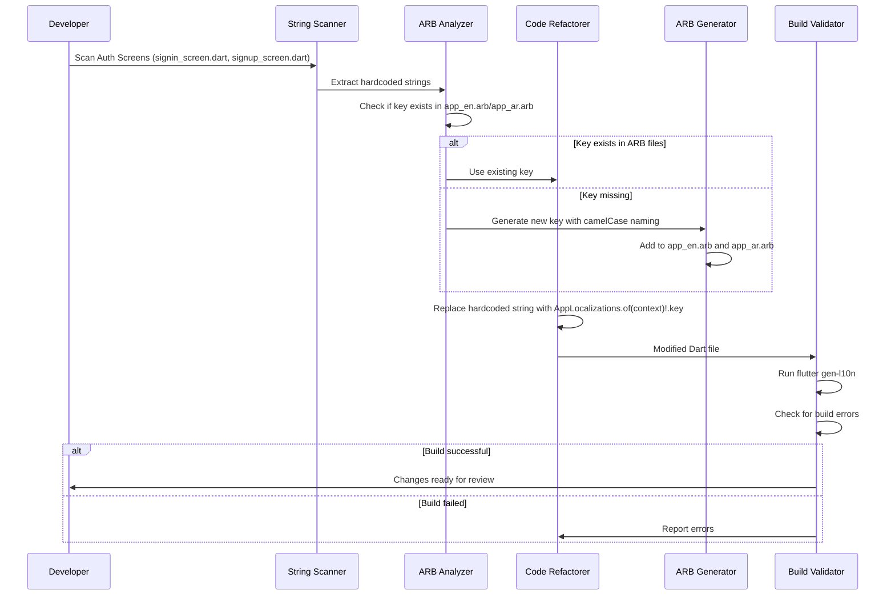

# Design Document: Automate Localization for BanHops Flutter App

## Overview

This feature systematically replaces all hardcoded English or Arabic text strings across the BanHops Flutter app with their corresponding localization getters using `AppLocalizations.of(context)!.keyName`. The app already has localization infrastructure set up with `app_en.arb` and `app_ar.arb` files. This design focuses on Phase 1 (Auth screens: Sign In & Sign Up) as the priority, with a phased approach for remaining screens.

## Main Algorithm/Workflow



## Core Interfaces/Types

```dart
// ── String Replacement Record ──
class LocalizationReplacement {
  final String filePath;
  final String originalString;
  final String localizationKey;
  final bool keyExisted;
  final int lineNumber;
  
  const LocalizationReplacement({
    required this.filePath,
    required this.originalString,
    required this.localizationKey,
    required this.keyExisted,
    required this.lineNumber,
  });
}

// ── ARB Entry ──
class ARBEntry {
  final String key;
  final String englishValue;
  final String arabicValue;
  
  const ARBEntry({
    required this.key,
    required this.englishValue,
    required this.arabicValue,
  });
}

// ── Scan Result ──
class ScanResult {
  final List<HardcodedString> foundStrings;
  final String filePath;
  
  const ScanResult({
    required this.foundStrings,
    required this.filePath,
  });
}

// ── Hardcoded String ──
class HardcodedString {
  final String value;
  final int lineNumber;
  final StringContext context;
  
  const HardcodedString({
    required this.value,
    required this.lineNumber,
    required this.context,
  });
}

enum StringContext {
  textWidget,           // Text("hardcoded")
  validationMessage,    // return "error message"
  snackbarMessage,      // SnackBar(content: Text("msg"))
  buttonLabel,          // ElevatedButton(child: Text("label"))
  hintText,            // decoration: InputDecoration(hintText: "hint")
  labelText,           // decoration: InputDecoration(labelText: "label")
  other
}
```

## Key Functions with Formal Specifications

### Function 1: scanFileForHardcodedStrings()

```dart
ScanResult scanFileForHardcodedStrings(String filePath)
```

**Preconditions:**
- `filePath` points to a valid Dart file in `lib/screens/` or `lib/widgets/`
- File is readable and well-formed Dart code

**Postconditions:**
- Returns `ScanResult` containing all hardcoded strings found
- Each string includes line number and context for replacement
- Excludes strings that are already localized (using `AppLocalizations`)
- Excludes technical strings (import paths, class names, property names)

**Loop Invariants:** N/A

### Function 2: checkKeyExistsInARB()

```dart
bool checkKeyExistsInARB(String key, Map<String, dynamic> arbContent)
```

**Preconditions:**
- `key` is a non-empty string
- `arbContent` is a valid parsed JSON from `.arb` file

**Postconditions:**
- Returns `true` if key exists in ARB content
- Returns `false` if key does not exist
- No modifications to arbContent

**Loop Invariants:** N/A

### Function 3: generateKeyName()

```dart
String generateKeyName(String originalString)
```

**Preconditions:**
- `originalString` is non-empty

**Postconditions:**
- Returns camelCase key name
- Key follows naming conventions: descriptive, lowercase first letter
- Removes special characters and spaces
- Example: "Phone number is required" → "phoneNumberRequired"

**Loop Invariants:** N/A

### Function 4: replaceWithLocalization()

```dart
String replaceWithLocalization(
  String fileContent,
  HardcodedString hardcodedString,
  String localizationKey
)
```

**Preconditions:**
- `fileContent` is valid Dart code
- `hardcodedString` exists in fileContent at specified line
- `localizationKey` is a valid identifier

**Postconditions:**
- Returns modified fileContent with hardcoded string replaced
- Replacement uses pattern: `l10n.keyName` or `AppLocalizations.of(context)!.keyName`
- Original code structure preserved (indentation, formatting)
- Only the target string is modified

**Loop Invariants:** N/A

## Algorithmic Pseudocode

### Main Processing Algorithm

```pascal
ALGORITHM processLocalizationAutomation(screenFiles)
INPUT: screenFiles - list of Dart file paths to process
OUTPUT: replacementLog - list of all replacements made

BEGIN
  ASSERT screenFiles is non-empty list of valid file paths
  
  // Step 1: Load existing ARB files
  arbEn ← loadJSON("lib/l10n/app_en.arb")
  arbAr ← loadJSON("lib/l10n/app_ar.arb")
  
  replacementLog ← empty list
  newEntries ← empty list
  
  // Step 2: Process each screen file
  FOR each filePath IN screenFiles DO
    ASSERT fileExists(filePath) AND isReadable(filePath)
    
    // Scan for hardcoded strings
    scanResult ← scanFileForHardcodedStrings(filePath)
    fileContent ← readFile(filePath)
    
    // Process each hardcoded string found
    FOR each hardcoded IN scanResult.foundStrings DO
      ASSERT hardcoded.value is not empty
      
      // Check if key exists or generate new one
      IF keyExistsForString(hardcoded.value, arbEn) THEN
        locKey ← findExistingKey(hardcoded.value, arbEn)
        keyExisted ← true
      ELSE
        locKey ← generateKeyName(hardcoded.value)
        
        // Ensure key is unique
        WHILE keyExists(locKey, arbEn) DO
          locKey ← locKey + "Alt"
        END WHILE
        
        // Add to new entries for both languages
        newEntries.add(
          ARBEntry(
            key: locKey,
            englishValue: hardcoded.value,
            arabicValue: translateOrPlaceholder(hardcoded.value)
          )
        )
        keyExisted ← false
      END IF
      
      // Replace in file content
      fileContent ← replaceWithLocalization(
        fileContent,
        hardcoded,
        locKey
      )
      
      // Log the replacement
      replacementLog.add(
        LocalizationReplacement(
          filePath: filePath,
          originalString: hardcoded.value,
          localizationKey: locKey,
          keyExisted: keyExisted,
          lineNumber: hardcoded.lineNumber
        )
      )
    END FOR
    
    // Write modified file
    writeFile(filePath, fileContent)
  END FOR
  
  // Step 3: Update ARB files with new entries
  IF newEntries is not empty THEN
    FOR each entry IN newEntries DO
      arbEn[entry.key] ← entry.englishValue
      arbAr[entry.key] ← entry.arabicValue
    END FOR
    
    writeJSON("lib/l10n/app_en.arb", arbEn)
    writeJSON("lib/l10n/app_ar.arb", arbAr)
  END IF
  
  // Step 4: Regenerate localization files
  executeCommand("flutter gen-l10n")
  
  // Step 5: Validate build
  buildResult ← executeCommand("flutter analyze")
  ASSERT buildResult.exitCode = 0
  
  RETURN replacementLog
END
```

**Preconditions:**
- screenFiles contains valid paths to Dart screen files
- ARB files exist at `lib/l10n/app_en.arb` and `lib/l10n/app_ar.arb`
- Flutter environment is properly configured

**Postconditions:**
- All hardcoded strings in screenFiles are replaced with localization keys
- ARB files contain all necessary keys (existing + new)
- Generated localization files are up to date
- Code passes `flutter analyze` without errors
- replacementLog contains complete record of all changes

**Loop Invariants:**
- All previously processed files have valid localization references
- ARB files remain valid JSON throughout processing
- File system operations maintain data integrity

### Scan Algorithm

```pascal
ALGORITHM scanFileForHardcodedStrings(filePath)
INPUT: filePath - path to Dart file
OUTPUT: scanResult - ScanResult with found strings

BEGIN
  content ← readFile(filePath)
  foundStrings ← empty list
  lines ← splitIntoLines(content)
  
  // Pattern matching for different string contexts
  FOR lineIndex FROM 0 TO length(lines) - 1 DO
    line ← lines[lineIndex]
    
    // Skip lines with localization already present
    IF line CONTAINS "AppLocalizations.of(context)" OR line CONTAINS "l10n." THEN
      CONTINUE
    END IF
    
    // Skip imports, comments, and technical strings
    IF isImport(line) OR isComment(line) OR isTechnicalString(line) THEN
      CONTINUE
    END IF
    
    // Extract string literals (both single and double quotes)
    stringMatches ← extractStringLiterals(line)
    
    FOR each match IN stringMatches DO
      context ← determineContext(line, match)
      
      // Only include user-facing strings
      IF isUserFacingString(match, context) THEN
        foundStrings.add(
          HardcodedString(
            value: match,
            lineNumber: lineIndex + 1,
            context: context
          )
        )
      END IF
    END FOR
  END FOR
  
  RETURN ScanResult(
    foundStrings: foundStrings,
    filePath: filePath
  )
END
```

**Preconditions:**
- filePath points to a valid, readable Dart file

**Postconditions:**
- Returns all user-facing hardcoded strings
- Excludes already-localized strings
- Excludes technical/system strings
- Each string has accurate line number and context

**Loop Invariants:**
- All processed lines maintain correct line numbering
- String extraction preserves original text exactly

## Example Usage

```dart
// Example 1: Phase 1 - Process Auth Screens
void main() async {
  final authScreens = [
    'lib/screens/signin_screen.dart',
    'lib/screens/signup_screen.dart',
  ];
  
  final replacements = await processLocalizationAutomation(authScreens);
  
  // Review changes
  for (final replacement in replacements) {
    print('File: ${replacement.filePath}');
    print('  Line ${replacement.lineNumber}: "${replacement.originalString}"');
    print('  → l10n.${replacement.localizationKey}');
    print('  Key ${replacement.keyExisted ? "existed" : "created"}');
  }
}

// Example 2: Scan single file
void scanSignInScreen() async {
  final result = scanFileForHardcodedStrings('lib/screens/signin_screen.dart');
  
  print('Found ${result.foundStrings.length} hardcoded strings:');
  for (final str in result.foundStrings) {
    print('  Line ${str.lineNumber}: "${str.value}" (${str.context})');
  }
}

// Example 3: Check and generate key
void processString() {
  final arbContent = loadJSON('lib/l10n/app_en.arb');
  final hardcodedString = "Phone number is required";
  
  bool exists = checkKeyExistsInARB("phoneNumberRequired", arbContent);
  
  if (!exists) {
    final newKey = generateKeyName(hardcodedString);
    print('Generated key: $newKey'); // Output: phoneNumberRequired
  }
}
```

## Correctness Properties

### Universal Quantification Statements

**Property 1: Localization Key Existence**
```
∀ file ∈ processedFiles, ∀ key ∈ usedKeys(file):
  key ∈ keys(app_en.arb) ∧ key ∈ keys(app_ar.arb)
```
*For all processed files, every localization key used must exist in both English and Arabic ARB files.*

**Property 2: No Hardcoded User-Facing Strings**
```
∀ file ∈ processedFiles, ∀ string ∈ strings(file):
  isUserFacing(string) ⟹ isLocalized(string)
```
*For all processed files, every user-facing string must be localized.*

**Property 3: ARB File Synchronization**
```
∀ key ∈ keys(app_en.arb):
  key ∈ keys(app_ar.arb) ∧ 
  (key ≠ "@@locale" ⟹ value(key, app_en.arb) ≠ null ∧ value(key, app_ar.arb) ≠ null)
```
*Every key in English ARB file (except metadata) must exist in Arabic ARB file with non-null values.*

**Property 4: Key Naming Convention**
```
∀ key ∈ generatedKeys:
  isCamelCase(key) ∧ 
  startsWithLowercase(key) ∧ 
  containsOnlyAlphanumeric(key)
```
*All generated keys must follow camelCase naming convention, start with lowercase, and contain only alphanumeric characters.*

**Property 5: Build Validity**
```
∀ file ∈ processedFiles:
  isValidDartSyntax(file) ∧ 
  passesFlutterAnalyze(file)
```
*All processed files must remain valid Dart code and pass Flutter's static analysis.*

**Property 6: Replacement Accuracy**
```
∀ replacement ∈ replacementLog:
  originalStringExists(replacement.filePath, replacement.lineNumber, replacement.originalString) ⟹
  replacementCorrect(replacement.filePath, replacement.localizationKey)
```
*For every logged replacement, if the original string existed at the specified location, the replacement must be correctly implemented.*

## Error Handling

### Error Scenario 1: Missing Localization Context

**Condition**: A widget uses localization key but `AppLocalizations.of(context)` returns null
**Response**: Add null-safe check or ensure `Localizations.override` wraps the widget tree
**Recovery**: Use fallback text or display error message; log warning for developer

### Error Scenario 2: Duplicate Key Generation

**Condition**: Generated key already exists in ARB files with different value
**Response**: Append suffix (e.g., "Alt", "2") to make key unique
**Recovery**: Log warning; manual review recommended to consolidate duplicate concepts

### Error Scenario 3: ARB File Parse Error

**Condition**: ARB file contains invalid JSON syntax
**Response**: Stop processing; report specific syntax error location
**Recovery**: Do not modify files; require manual fix of ARB file before proceeding

### Error Scenario 4: Build Failure After Replacement

**Condition**: `flutter gen-l10n` or `flutter analyze` fails after string replacement
**Response**: Identify specific file and line causing error
**Recovery**: Revert changes to problematic file; log error for manual inspection

### Error Scenario 5: Missing Translation

**Condition**: New key added to app_en.arb but Arabic translation not available
**Response**: Use placeholder "[AR] English Text" or English value with comment marker
**Recovery**: Flag for manual translation; app remains functional with English fallback

## Testing Strategy

### Unit Testing Approach

**Test Suite 1: String Scanning**
- Test `scanFileForHardcodedStrings()` with sample files containing various string patterns
- Verify correct extraction of strings in different contexts (Text widget, validators, SnackBar)
- Ensure exclusion of already-localized strings, imports, and technical strings
- Test edge cases: empty files, files with no strings, files with only localized strings

**Test Suite 2: Key Generation**
- Test `generateKeyName()` with various input strings
- Verify camelCase conversion: "Phone number" → "phoneNumber"
- Test special character handling: "Don't have an account?" → "dontHaveAccount"
- Test uniqueness logic when duplicate keys exist

**Test Suite 3: ARB Manipulation**
- Test `checkKeyExistsInARB()` with existing and non-existing keys
- Test ARB file updates with new entries
- Verify JSON format preservation after modifications

**Test Suite 4: String Replacement**
- Test `replaceWithLocalization()` maintains code structure
- Verify correct replacement in different contexts:
  - `Text("label")` → `Text(l10n.label)`
  - `return "error"` → `return l10n.error`
  - `hintText: "hint"` → `hintText: l10n.hint`

**Coverage Goals:**
- 90%+ code coverage for utility functions
- 100% coverage for key generation and validation logic

### Property-Based Testing Approach

**Property Test Library**: fast-check (Dart equivalent: test with randomized inputs)

**Property Test 1: Key Generation Idempotency**
```dart
// Property: Generating a key from the same string always produces the same result
forAll(arbitraryString, (str) {
  final key1 = generateKeyName(str);
  final key2 = generateKeyName(str);
  expect(key1, equals(key2));
});
```

**Property Test 2: ARB Synchronization**
```dart
// Property: After processing, all keys in en.arb exist in ar.arb
forAll(arbitraryScreenFiles, (files) {
  final result = processLocalizationAutomation(files);
  final enKeys = loadJSON('app_en.arb').keys.toSet();
  final arKeys = loadJSON('app_ar.arb').keys.toSet();
  expect(enKeys, equals(arKeys));
});
```

**Property Test 3: Replacement Reversibility**
```dart
// Property: Can identify all localization keys used in a file
forAll(arbitraryDartFile, (file) {
  final originalStrings = scanFileForHardcodedStrings(file);
  final processedFile = processLocalizationAutomation([file]);
  final keysUsed = extractLocalizationKeys(processedFile);
  expect(keysUsed.length, equals(originalStrings.length));
});
```

### Integration Testing Approach

**Integration Test 1: End-to-End Auth Screen Processing**
- Input: `signin_screen.dart` and `signup_screen.dart` with hardcoded strings
- Process: Run full localization automation pipeline
- Verify: 
  - All user-facing strings replaced
  - ARB files updated correctly
  - `flutter gen-l10n` succeeds
  - App builds without errors
  - Screens display correct localized text in both languages

**Integration Test 2: Incremental Phase Processing**
- Process Phase 1 (Auth screens)
- Verify changes and commit
- Process Phase 2 (Home screen)
- Verify no regression in Phase 1 screens

**Integration Test 3: Multi-Language Validation**
- Run app with English locale
- Verify all auth screen texts display in English
- Switch to Arabic locale
- Verify all texts display in Arabic with proper RTL layout

## Performance Considerations

**File I/O Optimization:**
- Batch file reads/writes to minimize disk operations
- Cache ARB file contents in memory during processing session
- Use streaming for large files if needed

**Pattern Matching Efficiency:**
- Use regex patterns for string extraction (O(n) complexity)
- Avoid nested loops when scanning files
- Process files in parallel if processing multiple phases

**Build Time:**
- `flutter gen-l10n` adds ~2-5 seconds to build time
- Consider running only once after all changes rather than per-file

## Security Considerations

**File Integrity:**
- Validate file paths to prevent path traversal attacks
- Ensure write operations only target intended files in `lib/` directory
- Back up original files before modifications

**Input Validation:**
- Sanitize generated key names to prevent injection
- Validate ARB file JSON structure before parsing
- Ensure user-provided strings don't contain malicious code

## Dependencies

**Existing Dependencies:**
- `flutter_localizations`: SDK (already installed)
- `intl`: any (already installed)
- Flutter l10n generator (built-in)

**Development Tools:**
- `flutter analyze`: For static code analysis
- `flutter gen-l10n`: For generating localization code
- `flutter test`: For running test suites

**No New Dependencies Required**: This feature uses existing infrastructure

## Phase 1 Specific Details

### Affected Files
- `lib/screens/signin_screen.dart`
- `lib/screens/signup_screen.dart`

### Known Hardcoded Strings to Replace

**In `signup_screen.dart` (Line 96-97):**
```dart
// Current:
if (v == null || v.trim().isEmpty) return 'Phone number is required';

// After:
if (v == null || v.trim().isEmpty) return l10n.phoneRequired;
```

**In `signup_screen.dart` (Line 98-99):**
```dart
// Current:
if (digits.length < 10) return 'Enter a valid phone number';

// After - New key needed:
if (digits.length < 10) return l10n.invalidPhoneNumber;
```
*Note: Add to both app_en.arb and app_ar.arb:*
```json
"invalidPhoneNumber": "Enter a valid phone number",  // English
"invalidPhoneNumber": "أدخل رقم هاتف صحيح",          // Arabic
```

**In `signup_screen.dart` (Line 252):**
```dart
// Current:
label: 'PHONE NUMBER',

// After - New key needed:
label: l10n.phoneNumber.toUpperCase(),
```
*Note: Key `phoneNumber` already exists in ARB files*

**In `signup_screen.dart` (Line 253):**
```dart
// Current:
hint: '+20 1XX XXX XXXX',

// After - New key needed:
hint: l10n.phoneNumberPlaceholder,
```
*Note: Add to both ARB files:*
```json
"phoneNumberPlaceholder": "+20 1XX XXX XXXX",     // English
"phoneNumberPlaceholder": "+20 1XX XXX XXXX",     // Arabic (same format)
```

**In `signup_screen.dart` (Line 321):**
```dart
// Current:
const SnackBar(
  content: Text("Account created successfully"),
),

// After - New key needed:
SnackBar(
  content: Text(l10n.accountCreatedSuccessfully),
),
```
*Note: Add to both ARB files:*
```json
"accountCreatedSuccessfully": "Account created successfully",  // English
"accountCreatedSuccessfully": "تم إنشاء الحساب بنجاح",        // Arabic
```

### Existing Keys to Use

From `app_en.arb` and `app_ar.arb` (already defined):
- `signIn`, `signUp`
- `username`, `email`, `password`, `confirmPassword`
- `firstName`, `lastName`
- `phoneNumber`, `phoneRequired`
- `usernameRequired`, `passwordRequired`, `emailRequired`, `confirmPasswordRequired`
- `firstNameRequired`, `lastNameRequired`
- `invalidEmail`, `passwordTooShort`, `passwordsDoNotMatch`
- `usernameHint`, `passwordHint`, `emailHint`, `firstNameHint`, `lastNameHint`
- `forgotPassword`
- `dontHaveAccount`, `alreadyHaveAccount`

### New Keys Required for Phase 1

```json
{
  "invalidPhoneNumber": "Enter a valid phone number",
  "phoneNumberPlaceholder": "+20 1XX XXX XXXX",
  "accountCreatedSuccessfully": "Account created successfully"
}
```

### Expected Outcome for Phase 1

**Files Modified:** 2 (signin_screen.dart, signup_screen.dart)  
**Strings Replaced:** 5 hardcoded strings  
**New ARB Keys Added:** 3  
**Build Status:** Should pass `flutter analyze` and run without errors  
**Visual Impact:** No UI changes; same appearance in both languages
